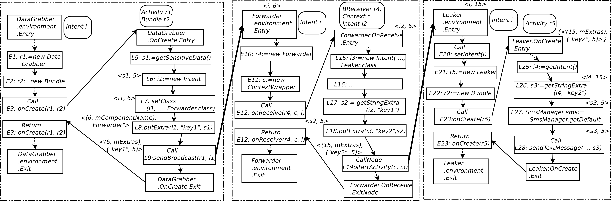

.. _approach:

The Amandroid Approach
#########################

.. NOTE:: Under Construction!!!!!

.. _IR-tran:

IR Translation
====================

Amandroid decompresses the input app apk file and retrieves a dex file and covert it to an IR format for subsequent analysis. Our dex2IR translator is a modification of the original dexdump tool shipped with the Android platform tool set; the C++ source of the original dexdump is available in the Android build package, and we modified it so that it can also produce the app representation in our IR format.

.. _env-model:

Environment Modeling
====================

An Android app is not a closed system; the Android system provides an environment in which the app runs. The code that may execute during the lifetime of an app is not all present in the app’s package. The Android system (which includes the Android runtime) does a bulk of the work in addition to that by the app’s code. With the “sensitive-sms” app example in ``Section 2``, we demonstrated that a static analyzer needs to model the Android system to analyze the system-defined control flows in the app. Our modeling of the Android environment follows that of `FlowDroid <http://sseblog.ec-spride.de/tools/flowdroid/>`_ with a few crucial extensions described below.

In Android, numerous types of events (e.g., system events, UI events, etc.) can trigger callback methods defined in the app. As an example, while an Activity A is running, if another Activity B comes to the foreground, it is considered an event. This event can trigger A.onPause, which is either defined in the app’s code, or in the Android framework if the developer did not override the default method. Figure 1b depicts the life cycle of an Activity. There are seven important life-cycle methods of an Activity: onCreate, onPause, onResume, etc.; they each represent a state in the transition diagram. Android documentation specifies other states such as Activity running and Activity shut down.

Amandroid introduces component-level models instead of FlowDroid’s whole app-level model. The environment of a component C represents a main method, EC, which takes as parameter an incoming intent i and invokes C’s life-cycle methods (e.g., onCreate or onReceive) based on C’s type (Activity, Service, Broadcast Receiver, etc.) and other callback methods (e.g., onLocationChanged) so that all possible paths are included. This component-level model is more effective in capturing the impact of the Android system on both the control and data of an app’s execution. The part below the dotted line in Figure 1a highlights this idea: a dedicated environment for each component invokes the set of implemented callback methods; this is the control part of modeling Android’s environment. In addition, the environment also keeps tracks of the intents received by the component (e.g., Environment of Leaker remembers that p3 was sent to start Leaker) so that the intents could be made available when necessary (e.g., to serve getIntent() in the Leaker component); this is the data part of modeling Android’s environment. EC also passes the intent parameter when necessary for other relevant methods (e.g., onReceive).

Amandroid generates Ec automatically. First, it collects basic information from the resource files in the apk and uses this information to collect layout callback methods. It then generates the body of Ec with lifecycle methods based on the type of C. Finally, it collects other callback methods (e.g., onLocationChanged) in C (through a reachability analysis) in an incremental fashion (following the FlowDroid approach). All of these are done before performing the data flow analysis.

.. _IDFG:

Inter-component Data Flow Graph (IDFG)
====================

Determining object points-to information is a core underlying problem in almost
all static analyses for Android app security, such as finding information
leaks, inferring ICC calls, identifying misuse of certain library functions, and
others. Instead of addressing each of these problems using different specialized
models and algorithms, it is advantageous and more elegant to pre-calculate ``all``
object points-to information at once, and use this as a general framework for
different types of further analysis.

Thus, the core task of Amandroid’s analysis is aimed to build a precise
inter-component  data flow graph (``IDFG``) of the app; the flow-sensitive and
context-sensitive data flow analysis to calculate object points-to information
is done ``at the same time`` with building inter-procedural control flow graph
(``ICFG``). This is because in order for one to precisely know the implementation
method of a virtual method invocation, one needs to know the receiver object's
dynamic type; conversely, flow-sensitive data flow analysis requires one to know
how the program control flows. Thus, there is a mutual dependency between the
two analyses. 

Such integrated control and data flow analyses approach has been demonstrated to
be both practical and effective for even analyzing temporal properties of
{``concurrent``} Java programs including the standard Java library
codebase~\cite{dwyer2006evaluating}. However, \cite{dwyer2006evaluating} does
not keep track of method calling context (typically termed \emph{monovariant}
calling context analysis or 0-calling context~\cite{nielson1999principles}).
We generalize the approach to precisely track the last ``k`` calling contexts
(\emph{polyvariant}~\cite{nielson1999principles}, \aka ``k``-limiting where ``k``
is user-configurable and the additional calling context beyond $k$ is monovariant).

Amandroid follows the classical static analysis
approach~\cite{nielson1999principles} customized to address the number of
aforementioned challenges in analyzing Android apps.
It computes points-to facts for each statement.

There are two sets of facts associated with each statement: the set of facts
entering into a statement ``s`` is called the ``entry set`` of ``s`` (or just
``Entry(s)``); the set of facts exiting a statement ``s`` is called the 
``exit set`` of ``s`` (or just ``Exit(s)``).
Statement ``s`` may change ``Entry(s)`` by killing stale facts (``Kill(s)`) and/or
generating new facts (``Gen(s)``).
The ``Gen`` and ``Kill`` sets can be calculated using flow functions that are
based on ``s``’ semantics. In general, the flow equations have the 
following forms.

Entry(s) = (Exit(s) \setminus Kill(s)) \cup Gen(s)

Below we introduce the notations in ``IDFG`` and
use the example in Section~\ref{sec:motivation} to explain its semantics.
Figure~\ref{fig:appIdfg} is the resulting 
``IDFG`` of the exmaple app, using ``DataGrabber`` as the entry point.

   Figure: An excerpt from the ``IDFG`` of the app ``sensitive-sms``.

.. _DDG:

Data Dependence Graph (DDG)
====================

The data dependence graph ``DDG`` is derived from the ``IDFG``. The ``DDG``
reflects how instance and variable definitions flow through the
program. With the help of ``DDG``, we can argue which part(s) of the program a
particular program-point depends on with respect to these two types of flows. As
a matter of fact, the ``DDG`` is a directional graph like the ``ICFG``. 

Since object flow along ICC edges is already captured in ``IDFG``, the constructed ``DDG``
automatically captures data dependencies across component boundaries.
As an example, in Figure~\ref{fig:appIdfg}, the 
\emph{sendTextMessage(..., s3)} in \emph{Leaker} uses \Var{s3}
while the $\EN$ of this statement has a fact \Fact{s3, 5} which implies that 
\KW{Instance 5} is used in this statement. 
So, there is an object dependence edge from the corresponding $\CallNode$ (\textit{L28}) in
the \emph{Leaker} component to the
creation site (\textit{L5}) in the \emph{DataGrabber} component.