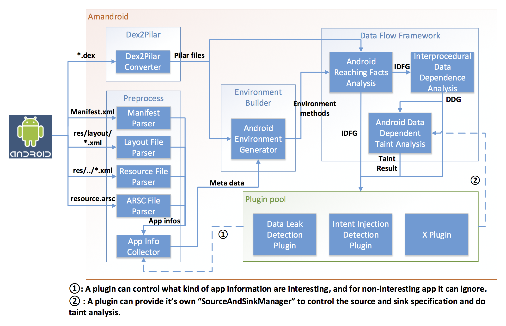

.. _intro:
.. include:: def-contact.rst

Introduction
##############

Overview
======================

.. sidebar:: Amandroid meaning

	Aman means secure in Indonesian, so Amandroid means secure android.

Amandroid is a static analysis framework for Android apps.

The Android platform is immensely popular. However, malicious or vulnerable applications have been reported to cause several security problems. Currently there is no effective method that a market operator can use to vet apps entering a market (e.g., Google Play).

Prior works using static analysis to address Android app security problems more focus on specific problems and built specialized tools for them. We observe that a large portion of those security issues can be resolved by addressing one underlying core problem – capturing semantic behaviors of the app such as object points-to and control-/data-flow information. Thus, we designed a new approach to conducting static analysis for vetting Android apps, and built a generic framework, called Amandroid, which does flow- and context-sensitive data flow analysis in an inter-component way.

Our approach shows that a comprehensive (tracking all objects) static analysis method on Android apps is totally feasible in terms of computation resources, and the Amandroid framework is flexible and easy to be extended for many types of specialized security analyses.

Since Amandroid directly handles Inter-component control and data flows, it can be used to address security problems that result from interactions among multiple components from either the same or different apps. Amandroid analysis is sound in that it can provide assurance of the absence of the specified security problems in an app with well-specified and reasonable assumptions on the Android runtime and its library.

On top of Amandroid we performed certain specific security analyses, for instance, a) user password flow tracking, b) intent injection detection, and c) crypto API misuse checking. We apply those analyses on hundreds of apps collected from Google Play’s popular apps and a third-party security company, and the results show that it is capable of finding real security issues and efficient enough in terms of analysis time.

Amandroid Workflow
=====================

   Figure: The pipeline of Amandroid framework.

.. sidebar:: Pilar

	Pilar is a highly flexible, typed, annotation based intermediate representation language designed by |Robby|.

	Pilar is the IR we used in Amandroid analysis, and we decompile dalvik bytecode to Pilar via modifying dexdump program.

Amandroid take an Android APK ``x`` as the input, then it works as following:

1. Extract ``x``, then parse ``*.dex`` file to Dex2Pilar module and other files (like ``*.xml``, ``resource.arsc``) to Preprocess module.

2. ``Dex2PilarConverter`` in ``Dex2Pilar`` module :ref:`decompile <IR-tran>` the ``*.dex`` file into Pilar format. Parsers in ``Preprocess`` module can provide app’s information to ``AppInfoCollector``. Developer can specify what kind of information he/she is interested and non-interesting app can be ignored. Finally, ``Preprocess`` module will output meta data of ``x``.

3. ``AndroidEnvironmentGenerator`` in ``EnvironmentBuilder`` is getting all sources codes and meta datas from previous step, then building the environment method for each of the component.

4.
	
	``DataFlowFramework`` provide data flow analysis technics to examine data flow problems. 

	``AndroidReachingFactsAnalysis`` takes environment methods as the entry points and :ref:`build IDFG <IDFG>`. 

	``InterproceduralDataDependenceAnalysis`` takes IDFG and :ref:`build DDG <DDG>`. 

	``AndroidDataDependentTaintAnalysis`` takes DDG and SourceAndSinkManager (provided by the developer) to do taint analysis and output taint result.

5. Developer specified plugin get all the result, then he/she can do further analysis or visualize it in certain way.

.. Note:: Source codes and environment appeals above are all Pilar format.